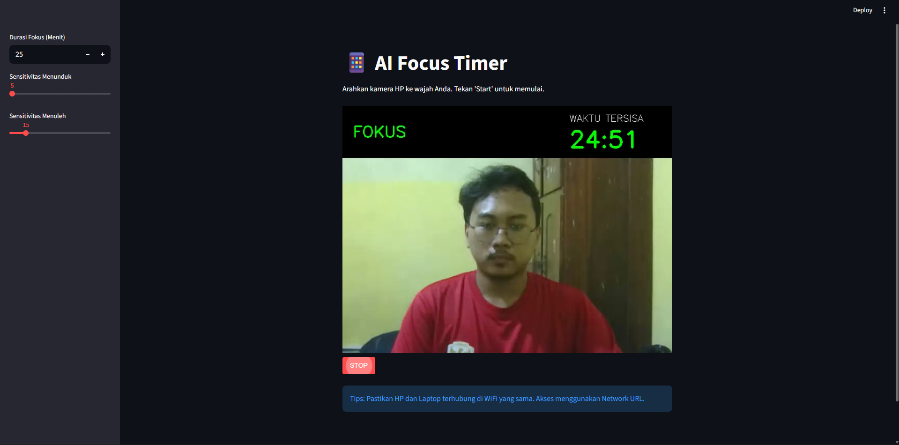

## 🎯 AI Focus Timer


An intelligent focus timer that uses **computer vision and artificial intelligence** to monitor your focus level in real time.

This project leverages **OpenCV** and **MediaPipe Face Mesh** to detect:

- Head movement (looking left/right, up/down)
- Eye closure (signs of drowsiness)
- Loss of focus

The timer only runs when you are truly focused, helping you build better concentration habits.

---

## 🚀 Features

✅ Real-time face tracking  
✅ Eye Aspect Ratio (EAR) for sleep detection  
✅ Automatic head pose analysis  
✅ Smart timer that pauses when you lose focus  
✅ Warning & alarm sounds  
✅ Manual pause/resume control  
✅ Automatic calibration  
✅ Minimalist UI overlay

---

## 📷 Preview

### 🖥️ Desktop Version



### 📱 Mobile Web Version


---

## 🧠 How It Works

The system uses your webcam to:

1. Track facial landmarks with MediaPipe
2. Calculate head pose (pitch & yaw)
3. Measure eye openness using EAR algorithm
4. Decide whether you are:
   - Focused ✅
   - Looking away ❌
   - Looking down ❌
   - Sleeping 😴

The timer only decreases **when you're focused**.

---

## 📸 Requirements

Make sure you have:

- Python 3.8+
- Webcam
- Windows OS (because of `winsound`)

---

## 📦 Installation

Install dependencies:

```bash
pip install opencv-python mediapipe numpy streamlit streamlit-webrtc av
```

---

## ▶️ How to Run

Run the script and follow the on-screen instructions:

```bash
python face_assistant.py
```

You will be asked to input your focus session duration in minutes.

---

## 📱 Mobile / Web Version (Streamlit)

This project also includes a **mobile-friendly web version** built with **Streamlit** and **WebRTC**.

You can run it directly in your browser and access it from your phone.

### How to Run the Web Version

```bash
streamlit run face_assistant.py
```

---

## 🎮 Controls

| Key | Action                    |
| --- | ------------------------- |
| `p` | Pause timer               |
| `s` | Resume timer              |
| `c` | Recalibrate face position |
| `q` | Quit program              |

---

## 🔊 Sound System

The app uses _winsound_ for real-time alerts:

Start session sounds

Pause sounds

Resume sounds

Warning beeps

Sleep alarm

Runs asynchronously to avoid video lag.

---

## 🛠️ Technologies Used

Python
OpenCV
MediaPipe
NumPy
Windows _winsound_
Threading
Streamlit  
WebRTC

---

## 📌 Use Cases

Students studying

Programmers coding

Remote workers

Productivity enthusiasts

---

📝 License

This project is free to use for learning and educational purposes.

---

👨‍💻 Author

Created by Rafif Nuha

---
